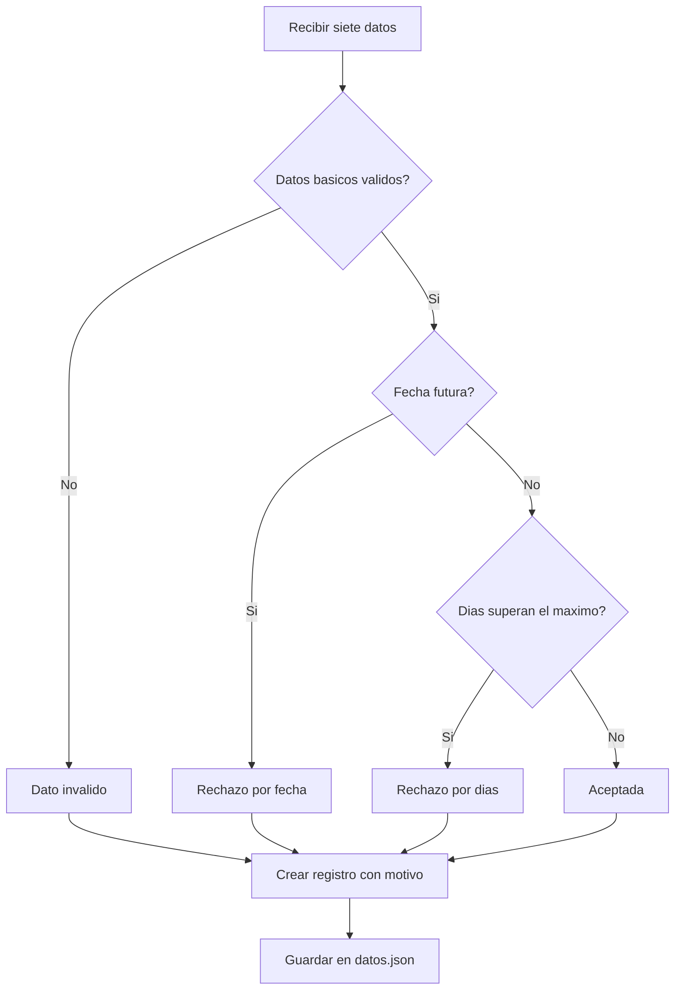
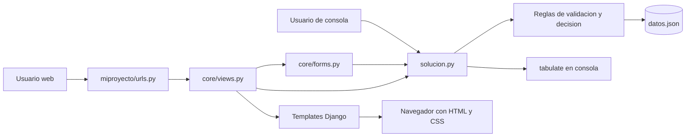

# SIGERH - Documento fuente para crear la presentacion del proyecto

> Este documento explica el proyecto completo y esta preparado para entregarse a GPT.
> El objetivo es que GPT transforme esta informacion en un guion de exposicion y en un
> prompt listo para generar una presentacion de 10 a 12 diapositivas con Gamma.

## 1. Ficha general

| Elemento | Descripcion |
|---|---|
| Nombre visible | SIGERH |
| Nombre funcional | Sistema de gestion y validacion de licencias medicas |
| Tipo de proyecto | Prototipo academico de programacion back end |
| Asignatura | Programacion Back End, Unidad 1, evaluacion ES1 |
| Problema central | La revision manual de licencias medicas puede producir errores y retrasos |
| Solucion | Ingresar, validar, clasificar, registrar y visualizar licencias medicas |
| Interfaces | Programa de consola y aplicacion web Django |
| Persistencia | Archivo local `datos.json` |
| Base de datos | No utiliza base de datos |
| Ruta web | `http://127.0.0.1:8000/resumen/` |
| Tecnologias principales | Python, Django, JSON, tabulate, HTML y CSS |
| Estado | MVP funcional para ejecucion y demostracion local |

El repositorio utiliza la marca SIGERH, pero no define formalmente el significado de
sus siglas. No se debe inventar una expansion del nombre durante la presentacion.

## 2. Resumen ejecutivo

SIGERH es un prototipo que apoya el registro y la evaluacion inicial de licencias
medicas de funcionarios. El usuario ingresa siete antecedentes relacionados con el
medico, el funcionario, la fecha y el reposo. El sistema valida los datos y entrega
uno de cuatro resultados con un motivo explicito.

Cada evaluacion se conserva en un archivo JSON. La misma logica puede utilizarse desde
una terminal o desde una pantalla web desarrollada con Django. En consola, los
registros se muestran como una tabla mediante `tabulate`. En la web, se muestran un
formulario, indicadores generales y una tabla con todos los registros.

La aplicacion fue construida como un MVP academico. Su objetivo es demostrar variables,
conversiones, operadores, estructuras `if/elif/else`, persistencia JSON, uso real de un
paquete externo y reutilizacion de logica en Django. No pretende reemplazar una
plataforma institucional ni procesar datos medicos reales en produccion.

## 3. Contexto y problema abordado

El escenario considerado es el de una organizacion que recibe licencias medicas y
revisa manualmente sus antecedentes. La revision manual puede ocasionar:

- Errores al interpretar o transcribir datos.
- Demoras en la tramitacion de cada licencia.
- Aplicacion inconsistente de las reglas de validacion.
- Dificultad para consultar rapidamente los resultados procesados.
- Riesgo de aceptar datos incompletos o incoherentes.

El proyecto no identifica una empresa real ni mide costos o tiempos concretos. Por lo
tanto, una presentacion no debe inventar nombres de organizaciones, porcentajes de
mejora, ahorros economicos ni estadisticas de impacto.

## 4. Solucion propuesta y valor

La solucion concentra el proceso basico en cinco acciones:

1. Recibir los siete datos de una licencia medica.
2. Validar nombres, RUT, numeros, fecha y tipo de licencia.
3. Aplicar una regla de decision con cuatro resultados posibles.
4. Guardar la evaluacion completa en `datos.json`.
5. Mostrar los resultados en consola y en una interfaz web.

El principal valor del prototipo es que aplica siempre el mismo orden de validacion y
explica el motivo de cada resultado. La logica esta centralizada en `solucion.py`, por
lo que la consola y Django no mantienen reglas de negocio separadas.

## 5. Objetivos

### Objetivo general

Desarrollar un sistema local que permita ingresar, validar, clasificar y registrar
licencias medicas mediante una regla de decision reutilizable desde consola y Django.

### Objetivos especificos

- Solicitar una variable por cada dato de entrada.
- Convertir dias de reposo y tipo de licencia a numeros enteros cuando sea posible.
- Verificar el digito validador de ambos RUT mediante modulo 11.
- Validar una fecha real en formato `DD/MM/AAAA`.
- Diferenciar datos invalidos de los dos motivos de rechazo.
- Conservar el estado y el motivo de cada evaluacion.
- Utilizar `tabulate` para presentar una tabla real en consola.
- Reutilizar en Django la regla implementada para la consola.
- Proteger el formulario web con CSRF.
- Mantener una interfaz utilizable en escritorio y dispositivos moviles.

## 6. Alcance del MVP

### Incluido en la version actual

- Ingreso manual de siete datos por consola.
- Ingreso de los mismos siete datos mediante un formulario web.
- Conversion y validacion de datos.
- Validacion del digito verificador de RUT chileno.
- Catalogo de siete tipos de licencia.
- Maximo de dias configurado para cada tipo.
- Cuatro resultados de decision con motivos diferentes.
- Persistencia local en JSON.
- Tabla de resumen en consola con `tabulate`.
- Pantalla Django en `/resumen/`.
- Indicadores de total, aceptadas, rechazadas y datos invalidos.
- Proteccion CSRF y patron Post/Redirect/Get.
- Estilos responsivos sin framework de JavaScript.
- Variables sensibles de Django separadas mediante `.env`.
- Pruebas automatizadas de consola, formulario y vista.

### Fuera de la version actual

- Base de datos relacional o no relacional.
- Autenticacion, perfiles y permisos de usuario.
- API REST o integracion con servicios externos.
- Lectura de PDF, imagenes u OCR.
- Validacion contra registros oficiales de medicos.
- Firma electronica o verificacion documental.
- Envio automatico de correos.
- Edicion o eliminacion de registros.
- Busqueda, filtros, paginacion o exportacion.
- Despliegue productivo multiusuario.

## 7. Priorizacion MoSCoW

| Prioridad | Funcionalidad | Estado actual |
|---|---|---|
| Must | Ingresar y convertir los siete datos | Implementada |
| Must | Aplicar cuatro resultados con motivos distintos | Implementada |
| Must | Guardar en `datos.json` | Implementada |
| Must | Mostrar el resumen con `tabulate` | Implementada |
| Must | Ingresar y consultar registros desde Django | Implementada |
| Should | Incorporar OCR | No implementada |
| Should | Alertar incoherencias adicionales entre fecha y reposo | No implementada |
| Could | Consultar una lista externa de medicos fraudulentos | No implementada |
| Could | Enviar notificaciones automaticas | No implementada |
| Won't | Incorporar Clave Unica, SQL, monorepo o API externa | Fuera del MVP |

OCR llego a explorarse en commits historicos, pero fue retirado para mantener el alcance
academico. No forma parte del codigo, las dependencias declaradas ni el flujo vigente.

## 8. Usuarios y casos de uso

El usuario conceptual es una persona encargada de revisar o registrar licencias medicas.
Como no existe autenticacion, el prototipo no distingue tecnicamente entre roles.

| Caso de uso | Resultado esperado |
|---|---|
| Registrar desde consola | Solicitar datos, evaluar, guardar y mostrar la tabla |
| Registrar desde la web | Validar el formulario, evaluar, guardar y volver al resumen |
| Consultar registros | Mostrar todos los elementos existentes en `datos.json` |
| Revisar estado | Mostrar estado, motivo y tipo de licencia de cada registro |
| Consultar indicadores | Mostrar total, aceptadas, rechazadas e invalidas |
| Abrir el sistema sin datos | Mostrar el formulario y un estado vacio sin fallar |

## 9. Datos de entrada

Cada licencia utiliza exactamente siete campos:

| Campo | Tipo de dominio | Ejemplo | Validacion principal |
|---|---|---|---|
| `nombre_medico` | Texto | `Ana Ejemplo` | Debe ser texto y no estar vacio |
| `rut_medico` | Texto | `12.345.678-5` | Debe superar validacion modulo 11 |
| `nombre_funcionario` | Texto | `Luis Prueba` | Debe ser texto y no estar vacio |
| `rut_funcionario` | Texto | `11.111.111-1` | Debe superar validacion modulo 11 |
| `dias_reposo` | Entero | `7` | Debe ser entero mayor que cero |
| `fecha_emision` | Texto con fecha | `01/01/2026` | Debe ser fecha real `DD/MM/AAAA` |
| `tipo_licencia` | Entero | `1` | Debe corresponder a un tipo entre 1 y 7 |

Los nombres y RUT del ejemplo son datos ficticios de demostracion. No deben presentarse
como informacion de personas reales.

## 10. Catalogo de tipos de licencia

El dominio mantiene los tipos y limites en la constante `TIPOS_LICENCIA`:

| Codigo | Tipo configurado | Maximo de dias |
|---:|---|---:|
| 1 | Enfermedad o accidente comun | 30 |
| 2 | Medicina preventiva | 2 |
| 3 | Licencia pre y postnatal | 180 |
| 4 | Enfermedad grave del nino menor de un anio | 180 |
| 5 | Accidente del trabajo o del trayecto | 365 |
| 6 | Enfermedad profesional | 365 |
| 7 | Patologias del embarazo | 84 |

Estos valores son reglas configuradas para el ejercicio academico. El repositorio no
incluye una fuente normativa, version legal ni fecha de vigencia. No se debe afirmar que
la tabla representa legislacion oficial actual sin aportar una fuente externa valida.

## 11. Validaciones de dominio

### Nombres

Ambos nombres deben ser cadenas de texto con al menos un caracter distinto de espacio.
La web limita cada nombre a 120 caracteres. La consola no aplica ese limite de longitud.

### RUT

La funcion `validar_rut()` elimina puntos y guiones, normaliza la letra `K` y calcula el
digito validador mediante modulo 11. Se validan tanto el RUT del medico como el del
funcionario.

Esta comprobacion verifica consistencia matematica, no existencia, identidad,
habilitacion profesional ni pertenencia del RUT.

La web limita cada RUT a 12 caracteres. La consola no aplica ese limite de longitud.

### Dias de reposo

El valor debe ser un entero mayor que cero. Una vez validado, se compara con el maximo
configurado para el tipo seleccionado.

### Fecha de emision

El dominio espera `DD/MM/AAAA`. `datetime.strptime()` comprueba que sea una fecha real.
Luego se compara con la fecha actual del sistema para detectar emisiones futuras.

El control web recibe internamente `AAAA-MM-DD`, porque ese es el formato enviado por
un campo HTML de tipo fecha, y lo transforma al formato del dominio.

### Tipo de licencia

Debe existir como clave en `TIPOS_LICENCIA`. En el flujo normal solo se aceptan los
codigos del 1 al 7.

## 12. Regla de decision

La funcion principal del dominio es `decidir()`. Devuelve una pareja formada por
`estado` y `motivo`. La prioridad es importante: siempre se comprueban primero los
datos invalidos.

| Prioridad | Condicion | Estado | Motivo general |
|---:|---|---|---|
| 1 | Existe un dato basico invalido | `Dato invalido` | Indica el primer dato incorrecto |
| 2 | La fecha de emision es futura | `Rechazo - fecha invalida` | La fecha de emision es futura |
| 3 | Los dias superan el maximo del tipo | `Rechazo - dias excedidos` | Informa maximo y dias ingresados |
| 4 | Todo lo anterior es valido | `Aceptada` | Licencia registrada correctamente |

La validacion de datos invalidos sigue este orden interno:

1. Nombres vacios o de tipo incorrecto.
2. RUT del medico o funcionario invalido.
3. Dias no enteros, iguales a cero o negativos.
4. Tipo fuera del catalogo.
5. Fecha con tipo o formato invalido.

Si una licencia presenta mas de un problema, se devuelve el primer motivo segun este
orden. Si una fecha es futura y tambien excede los dias, prevalece el rechazo por fecha.



## 13. Flujo de consola

La consola se ejecuta con `python solucion.py` y sigue este proceso:

1. `pedir_datos()` realiza siete llamadas a `input()`.
2. `convertir_entero()` intenta transformar dias y tipo mediante `int()`.
3. Si una conversion falla, conserva el texto para clasificarlo como dato invalido.
4. `crear_registro()` llama a `decidir()` y agrega estado y motivo.
5. `cargar()` obtiene los registros anteriores desde `datos.json`.
6. El nuevo registro se agrega a la lista.
7. `guardar()` reescribe el archivo JSON con la lista actualizada.
8. La consola imprime resultado, detalle y confirmacion.
9. `mostrar_tabulate()` presenta todos los registros en una tabla de formato `grid`.

Si el usuario cancela con `Ctrl+C` o se produce fin de entrada, el programa muestra un
mensaje de cancelacion en lugar de un traceback.

## 14. Flujo web

La aplicacion web utiliza una unica ruta funcional: `/resumen/`.

### Solicitud GET

1. Se crea un formulario vacio.
2. Se cargan los registros desde JSON.
3. La vista vuelve a aplicar `decidir()` a cada registro para mostrarlo con las reglas actuales.
4. Se agrega el nombre legible del tipo y una clase visual para el estado.
5. Se calculan cuatro indicadores.
6. Se renderiza `resumen.html`.

### Solicitud POST valida para Django

1. Django comprueba presencia, longitud y conversion de los campos.
2. La fecha se adapta al formato del dominio.
3. La vista llama a `crear_registro()`.
4. El dominio decide si la licencia es aceptada, rechazada o invalida.
5. El registro se agrega a `datos.json`.
6. La vista redirige a `/resumen/?guardada=1`.
7. El navegador realiza un nuevo GET y evita repetir el POST al actualizar.

### Solicitud POST con error de formulario

Si falta un campo o un valor no puede convertirse, el formulario muestra errores junto
al control afectado y no guarda un registro parcial.

Existe una diferencia intencional entre interfaces: la consola puede conservar un texto
no numerico y guardarlo como dato invalido; Django Forms detiene los errores de
conversion antes de ejecutar la regla de dominio.

## 15. Arquitectura

SIGERH usa una arquitectura simple de renderizado en servidor. No existe frontend
separado, API ni ORM.



### Responsabilidad de cada capa

| Capa | Responsabilidad |
|---|---|
| `solucion.py` | Catalogos, validacion, decision, persistencia y consola |
| `core/forms.py` | Campos web, conversiones y errores de formulario |
| `core/views.py` | GET, POST, persistencia, indicadores y contexto |
| `miproyecto/urls.py` | Conexion de `/resumen/` con la vista |
| Templates | Estructura HTML y presentacion de datos |
| CSS | Identidad visual, estados, responsive y foco |
| `datos.json` | Persistencia local de la lista de registros |

Esta centralizacion evita escribir una segunda regla de decision dentro de Django.

## 16. Persistencia y estructura de un registro

`datos.json` contiene una lista de objetos. Cada objeto conserva los siete datos de
entrada y dos resultados calculados:

```json
{
  "medico": "Ana Ejemplo",
  "rut_medico": "12.345.678-5",
  "funcionario": "Luis Prueba",
  "rut_funcionario": "11.111.111-1",
  "dias_reposo": 7,
  "fecha_emision": "01/01/2026",
  "tipo_licencia": 1,
  "estado": "Aceptada",
  "motivo": "Licencia registrada correctamente"
}
```

La ruta se calcula a partir de la ubicacion de `solucion.py`, por lo que no depende del
directorio desde el que se ejecute el comando. El archivo utiliza UTF-8, indentacion de
dos espacios y conserva caracteres sin escapar cuando es posible.

El archivo actual incluye cuatro registros ficticios preparados para demostrar:

- Una licencia aceptada.
- Un dato invalido por RUT.
- Un rechazo por fecha futura.
- Un rechazo por dias excedidos.

La vista web recalcula estado y motivo al mostrar cada registro. Esto permite aplicar las
reglas actuales, pero tambien significa que la pantalla puede diferir del estado historico
guardado si cambia la fecha o se modifican las reglas.

Si el archivo contiene JSON malformado, `cargar()` devuelve silenciosamente una lista
vacia. Un guardado posterior puede reemplazar el archivo corrupto y perder los registros
anteriores. Este comportamiento es una limitacion importante de la persistencia actual.

## 17. Interfaz web

La pantalla esta compuesta por:

- Barra superior con la marca SIGERH.
- Encabezado principal sobre gestion de licencias medicas.
- Mensaje de confirmacion despues de guardar.
- Cuatro indicadores de resumen.
- Formulario de siete campos.
- Errores junto a cada campo.
- Tabla completa de registros.
- Estado vacio cuando no existen datos.

### Identidad visual

La interfaz utiliza una apariencia institucional y sobria:

| Elemento | Tratamiento visual |
|---|---|
| Color principal | Azul marino |
| Acento | Dorado |
| Fondo | Papel claro y superficies blancas |
| Aceptada | Verde |
| Rechazada | Rojo |
| Dato invalido | Naranja |
| Titulos | Georgia o serif equivalente |
| Texto general | Segoe UI o sans serif equivalente |

### Responsive

En escritorio, el formulario y los indicadores aprovechan varias columnas. Bajo 800 px,
el formulario pasa a una columna y los indicadores se reorganizan. Bajo 520 px, se
reducen margenes y el boton ocupa todo el ancho. La tabla mantiene sus columnas y se
consulta mediante desplazamiento horizontal.

### Medidas basicas de accesibilidad

- Idioma del documento definido como espanol.
- Enlace para saltar al contenido principal.
- Etiquetas asociadas con cada control.
- Regiones y titulos semanticos.
- Mensajes de estado y error anunciables.
- Tabla con `caption` y encabezados de columna.
- Region desplazable accesible con teclado.
- Estados identificados mediante texto, no solo color.
- Foco visible en controles, boton y tabla.

Estas medidas no equivalen a una auditoria ni certificacion formal de conformidad WCAG.

## 18. Seguridad y configuracion

### Controles implementados

- `SECRET_KEY` se obtiene desde `.env` mediante `python-decouple`.
- `.env` esta excluido por `.gitignore`.
- `.env.example` documenta las variables requeridas sin publicar la clave real.
- `DEBUG` es configurable y usa `False` como valor predeterminado.
- El formulario incluye token CSRF.
- `CsrfViewMiddleware` rechaza solicitudes sin token valido.
- Los templates mantienen el escape automatico de Django.
- La redireccion posterior al POST utiliza una ruta interna conocida.

### Limites de seguridad

- No existe autenticacion ni autorizacion.
- Los nombres y RUT se guardan como texto plano.
- Cualquier persona con acceso a la aplicacion puede consultar los registros.
- No existe auditoria de usuario, fecha de creacion o cambios.
- No se configuraron controles de despliegue productivo como HTTPS o HSTS.
- `ALLOWED_HOSTS` esta vacio y la configuracion esta orientada a uso local.

Por estas razones deben utilizarse exclusivamente datos ficticios durante la demostracion.

## 19. Tecnologias y dependencias

| Tecnologia | Version declarada o utilizada | Uso |
|---|---:|---|
| Python | 3.14.2 en el entorno actual; minimo 3.12 para Django 6.1 | Lenguaje principal y consola |
| Django | 6.1 | Formularios, vista, rutas, templates y estaticos |
| python-decouple | 3.8 | Lectura de `SECRET_KEY` y `DEBUG` |
| tabulate | 0.10.0 | Tabla formateada en consola |
| JSON | Biblioteca estandar | Persistencia local |
| HTML5 | N/A | Estructura de la pantalla |
| CSS3 | N/A | Diseno visual y responsive |

El codigo vigente no utiliza ni declara dependencias para OCR, PDF, JavaScript o base de
datos. El contenido instalado localmente en `venv/` no define los requisitos del proyecto.

## 20. Estructura principal del repositorio

```text
sigerh/
|-- manage.py
|-- solucion.py
|-- datos.json
|-- requirements.txt
|-- .env.example
|-- .gitignore
|-- plan.md
|-- ia.md
|-- PRESENTACION_PROYECTO.md
|-- core/
|   |-- forms.py
|   |-- views.py
|   |-- tests.py
|   |-- templates/
|   |   |-- base.html
|   |   `-- resumen.html
|   `-- static/core/css/
|       `-- app.css
|-- miproyecto/
|   |-- settings.py
|   |-- urls.py
|   `-- wsgi.py
`-- openspec/
    |-- specs/
    `-- changes/
```

### Archivos complementarios

| Archivo o carpeta | Finalidad |
|---|---|
| `plan.md` | Problema, alcance, MoSCoW y plan tecnico academico |
| `ia.md` | Uso de IA, respuesta obtenida y revision personal |
| `openspec/` | Propuestas, especificaciones y tareas del desarrollo |
| `Instrucciones_ES1_ProgramacionBackEnd.pdf` | Instrucciones de la evaluacion |
| `ES1_RojasLorena.zip` | Paquete preparado para la entrega academica |

`.env`, `venv/`, bytecode y archivos temporales no deben utilizarse como contenido para
la presentacion ni publicarse.

## 21. Instalacion y ejecucion local

### Preparar el entorno

Se requiere Python 3.12 o superior. El entorno actual fue creado con Python 3.14.2.

```powershell
python -m venv venv
.\venv\Scripts\Activate.ps1
pip install -r requirements.txt
```

### Configurar variables

Crear un `.env` local tomando como referencia `.env.example`:

```text
SECRET_KEY=una-clave-local-segura
DEBUG=True
```

La clave real no debe agregarse a una diapositiva, prompt ni repositorio.

### Ejecutar la consola

```powershell
python solucion.py
```

### Ejecutar Django

```powershell
python manage.py runserver
```

Abrir `http://127.0.0.1:8000/resumen/`.

### Ejecutar verificaciones

```powershell
python manage.py test
python manage.py check
```

No se requieren migraciones porque el proyecto no usa base de datos.

## 22. Pruebas y calidad

El repositorio contiene 14 pruebas automatizadas basadas en `SimpleTestCase` y el
cliente de pruebas de Django.

La verificacion final ejecuto las 14 pruebas correctamente y `python manage.py check`
no reporto problemas de configuracion.

| Area | Escenarios cubiertos |
|---|---|
| Consola | Conservacion y evaluacion de entradas no numericas |
| Consola | Llamada a persistencia y tabla para datos invalidos |
| Formulario | Conversion de fecha y tipo para el dominio |
| Formulario | Opciones creadas desde `TIPOS_LICENCIA` |
| Formulario | Error al convertir dias no numericos |
| Vista GET | Pantalla con formulario y sin registros |
| Vista GET | Registro, nombre de tipo, estado e indicadores |
| Vista POST | Los cuatro resultados de la decision |
| Vista POST | Redireccion posterior al guardado |
| Seguridad | Rechazo de POST sin CSRF |
| Seguridad | Guardado con token CSRF valido |
| Interfaz | Confirmacion de guardado y localizacion del CSS |

La suite no configura una herramienta de cobertura, por lo que no existe un porcentaje
de cobertura que pueda citarse. La escritura real de JSON, los detalles del algoritmo de
RUT y el texto exacto producido por `tabulate` tienen cobertura automatizada limitada.

## 23. Relacion con la evaluacion ES1

La evaluacion considera 30 puntos distribuidos en cuatro criterios:

| Criterio | Puntaje | Evidencia en SIGERH |
|---|---:|---|
| 1.1.1 Variables y operaciones | 6 | Siete entradas, `int()`, calculo de RUT y maximos |
| 1.1.2 Instrucciones, estructuras y operadores | 6 | Cuatro resultados, `if/elif/else`, `and` y `or` |
| 1.1.3 Paquete externo | 6 | `tabulate` instalado, importado y usado realmente |
| 1.1.4 Aplicacion Django | 12 | Vista, URL, templates, JSON, entorno e `ia.md` |

### Correspondencia por fases

| Fase academica | Implementacion |
|---|---|
| Planificacion | `plan.md` con problema, solucion, alcance y MoSCoW |
| Programa Python | `solucion.py` con entrada y decision |
| Persistencia y paquete | `datos.json`, JSON y `tabulate` |
| Aplicacion web | Proyecto Django y ruta `/resumen/` |
| Uso reflexivo de IA | `ia.md` |

La aplicacion web actual supera la consulta minima solicitada porque tambien permite
registrar licencias, valida formularios, protege POST y muestra indicadores.

## 24. Uso de inteligencia artificial durante el proyecto

El archivo `ia.md` documenta el uso de OpenCode para ordenar el plan y revisar el
proyecto contra las instrucciones ES1. La revision detecto tres riesgos:

- La respuesta de IA necesitaba analisis en palabras de la estudiante.
- Las entradas no numericas de consola no se guardaban como datos invalidos.
- El codigo debia demostrar una combinacion con `and` segun el checklist.

La correccion personal consistio en comprender el requisito, utilizar `and` para validar
ambos nombres y conservar entradas no numericas para que pasaran por la misma regla,
se guardaran y aparecieran en la tabla. Tambien se mantuvo el MVP sin volver a agregar
OCR, base de datos ni funciones fuera del alcance.

Este punto es relevante para la defensa: la IA apoyo la revision, pero las decisiones
finales se justificaron y aplicaron de acuerdo con los requisitos academicos.

## 25. Demostracion sugerida

Una demostracion breve puede seguir este orden:

1. Presentar el problema y la regla de cuatro resultados.
2. Ejecutar `python solucion.py` con un caso aceptado.
3. Mostrar el estado, el motivo y la tabla generada por `tabulate`.
4. Abrir `/resumen/` y mostrar los cuatro indicadores.
5. Registrar desde el formulario una licencia que exceda los dias.
6. Mostrar la confirmacion, el rechazo y el motivo en la tabla.
7. Mostrar un error de conversion para comprobar que no se guarda parcialmente.
8. Reducir el ancho del navegador para demostrar el comportamiento responsive.
9. Cerrar explicando persistencia JSON, pruebas y limitaciones del MVP.

Los cuatro registros de ejemplo permiten mostrar todos los resultados sin utilizar datos
reales. La cantidad actual de ejemplos no debe presentarse como una metrica de negocio.

## 26. Fortalezas del proyecto

- Cumple el flujo completo desde entrada hasta visualizacion.
- Mantiene una sola regla de decision para consola y web.
- Devuelve motivos comprensibles, no solo estados.
- Implementa validacion matematica de RUT.
- Centraliza catalogos, estados, formatos y textos funcionales.
- Utiliza realmente el paquete externo solicitado.
- Protege los formularios contra CSRF.
- Evita reenvios por recarga mediante Post/Redirect/Get.
- Incluye pruebas para los cuatro resultados.
- Posee una interfaz responsive con medidas basicas de accesibilidad.
- Separa la clave secreta del codigo fuente.
- Mantiene un alcance coherente con el nivel y tiempo de la evaluacion.

## 27. Limitaciones actuales

| Limitacion | Consecuencia |
|---|---|
| Persistencia JSON | No es adecuada para multiples usuarios concurrentes |
| Reescritura completa | Dos procesos pueden sobrescribir cambios entre si |
| Escritura no atomica | Un fallo de escritura puede dejar el archivo incompleto |
| JSON sin esquema | Datos modificados externamente pueden romper el flujo |
| JSON malformado | Se trata como una lista vacia y un guardado posterior puede perder datos |
| Sin autenticacion | No hay control de acceso a nombres y RUT |
| Datos en texto plano | No debe utilizarse informacion sensible real |
| Sin identificadores | No existe trazabilidad individual de registros |
| Sin timestamps | No se registra cuando se creo cada evaluacion |
| Sin edicion ni eliminacion | Los errores guardados no pueden corregirse desde la web |
| Sin paginacion | Todos los registros se cargan y muestran a la vez |
| Reglas estaticas | Los maximos no tienen version ni fuente normativa incluida |
| Estado recalculado | El estado mostrado puede variar respecto del historico |
| Configuracion local | No esta preparado para un despliegue productivo |

Estas limitaciones son aceptables dentro del alcance academico, pero deben reconocerse
para no presentar el prototipo como una solucion institucional terminada.

## 28. Roadmap propuesto

### Etapa 1: fortalecer persistencia y trazabilidad

- Migrar desde JSON a una base de datos.
- Incorporar identificadores unicos y fechas de creacion.
- Agregar escritura transaccional y validacion de esquema.
- Permitir editar y corregir registros.

### Etapa 2: proteger datos y usuarios

- Agregar autenticacion y roles.
- Restringir la consulta segun permisos.
- Definir politicas de privacidad, auditoria y retencion.
- Enmascarar RUT en vistas generales.

### Etapa 3: mejorar operacion

- Incorporar busqueda, filtros y paginacion.
- Agregar exportacion de reportes.
- Crear historiales de cambios y paneles de seguimiento.
- Configurar pruebas de cobertura y monitoreo.

### Etapa 4: automatizacion e integraciones

- Evaluar OCR para documentos e imagenes.
- Integrar fuentes oficiales mediante servicios autorizados.
- Versionar las reglas y documentar su fuente normativa.
- Incorporar notificaciones y flujos de aprobacion.

El roadmap representa posibilidades futuras. Ninguna de estas funciones debe mostrarse
como implementada actualmente.

## 29. Mensaje central para la exposicion

> SIGERH demuestra como una regla de negocio puede implementarse una sola vez en
> Python y reutilizarse desde consola y Django para validar, explicar y registrar cuatro
> resultados diferentes, manteniendo un MVP pequeno, verificable y coherente con ES1.

## 30. Estructura sugerida de la presentacion

Se recomienda una presentacion de 11 diapositivas:

| Diapositiva | Titulo sugerido | Contenido principal | Recurso visual sugerido |
|---:|---|---|---|
| 1 | SIGERH | Nombre, subtitulo y objetivo | Portada con identidad azul y dorada |
| 2 | El problema | Revision manual, errores y retrasos | Flujo manual simplificado |
| 3 | La solucion y el MVP | Cinco acciones y alcance | Diagrama antes/despues |
| 4 | Datos y tipos de licencia | Siete entradas y catalogo | Tarjetas o tabla resumida |
| 5 | Regla de decision | Cuatro resultados y prioridad | Arbol de decision |
| 6 | Arquitectura | Consola, dominio, Django y JSON | Diagrama de componentes |
| 7 | Experiencia en consola | Entrada, guardado y `tabulate` | Terminal estilizada |
| 8 | Experiencia web | Formulario, metricas y tabla | Mockup basado en la interfaz real |
| 9 | Seguridad y calidad | CSRF, entorno y 14 pruebas | Escudo y checklist tecnico |
| 10 | Resultados y cumplimiento ES1 | Evidencias de los cuatro criterios | Matriz de criterios y puntajes |
| 11 | Limitaciones, roadmap y cierre | Evolucion futura y mensaje final | Linea de tiempo por etapas |

La presentacion debe equilibrar negocio y tecnologia. No debe convertirse en una lista
de archivos ni mostrar bloques extensos de codigo.

## 31. Direccion visual para Gamma

La presentacion puede inspirarse en la interfaz actual:

- Formato limpio, institucional y academico.
- Fondo marfil o papel claro.
- Azul marino como color dominante.
- Dorado como acento para titulos y elementos clave.
- Verde para aceptacion, rojo para rechazo y naranja para dato invalido.
- Titulos con una serif elegante y cuerpo con sans serif legible.
- Diagramas simples con pocas palabras.
- Una idea principal por diapositiva.
- Tablas reducidas; evitar trasladar tablas extensas completas.
- Iconografia sobria relacionada con documentos, validacion, consola y web.
- Uso moderado de capturas o mockups.
- Sin fotografias de pacientes, hospitales o documentos reales con datos personales.

Gamma puede recrear visualmente la pantalla, pero no debe inventar logotipos oficiales,
alianzas institucionales ni capturas de funcionalidades inexistentes.

## 32. Encargo para GPT

Utiliza todo el contenido anterior como fuente de verdad. Tu tarea es producir los
siguientes entregables en espanol correcto, con tildes y redaccion natural:

### Entregable A: enfoque narrativo

Define en un parrafo la historia central de la presentacion y explica por que ese enfoque
es adecuado para un docente evaluador de Programacion Back End.

### Entregable B: guion de 11 diapositivas

Entrega una tabla con estas columnas:

| Columna requerida | Contenido esperado |
|---|---|
| Numero | Orden de la diapositiva |
| Titulo | Titulo breve y comunicativo |
| Objetivo | Lo que debe comprender el evaluador |
| Contenido visible | Entre 3 y 5 puntos breves |
| Visual | Diagrama, tabla, mockup o elemento grafico sugerido |
| Notas del expositor | Explicacion oral clara y coherente |
| Transicion | Frase que conecta con la siguiente diapositiva |

Las notas del expositor deben explicar el proyecto, no leer literalmente los puntos de
la diapositiva.

### Entregable C: prompt final para Gamma

Genera un unico prompt listo para pegar en Gamma que incluya:

- Objetivo y audiencia de la presentacion.
- Estructura exacta de las 11 diapositivas.
- Texto breve que debe aparecer en cada una.
- Visual recomendado para cada diapositiva.
- Direccion de arte azul marino, dorado y papel claro.
- Uso de verde, rojo y naranja para los estados.
- Solicitud de diagramas para decision y arquitectura.
- Tono academico, profesional y comprensible.
- Indicacion de no inventar cifras, normativa o funcionalidades.
- Indicacion de utilizar exclusivamente datos ficticios.
- Cierre con fortalezas, limitaciones y roadmap.

### Entregable D: checklist de revision

Comprueba al final que:

- Existen entre 10 y 12 diapositivas; preferentemente 11.
- Los cuatro resultados aparecen correctamente.
- Se explica que JSON reemplaza temporalmente a una base de datos.
- Se muestra la reutilizacion de `solucion.py` desde Django.
- Se menciona el uso real de `tabulate`.
- Se incluyen CSRF, variables de entorno y pruebas.
- Las limitaciones estan presentadas con honestidad.
- El roadmap no se confunde con funciones actuales.
- No se afirma que OCR este implementado.
- No se inventa el significado de SIGERH.
- No se atribuye validez legal oficial a los maximos configurados.
- No aparecen datos personales reales.

## 33. Restricciones de exactitud para cualquier IA

La IA que genere el guion o la presentacion debe respetar estas reglas:

1. No afirmar que el sistema utiliza inteligencia artificial en su funcionamiento.
2. No afirmar que procesa PDF, imagenes u OCR actualmente.
3. No afirmar que utiliza una base de datos.
4. No afirmar que existe login, API, correo o integracion oficial.
5. No inventar porcentajes de reduccion de errores, tiempo o costos.
6. No presentar cuatro registros de prueba como una estadistica operativa.
7. No inventar una empresa cliente ni un caso real no documentado.
8. No inventar el significado de las siglas SIGERH.
9. No presentar los maximos de dias como normativa oficial verificada.
10. No exponer `SECRET_KEY`, contenido de `.env` ni datos sensibles.
11. Distinguir siempre entre version actual, limitaciones y roadmap.
12. Presentar el sistema como un MVP academico local, no como producto en produccion.

## 34. Fuentes internas del contenido

La informacion de este documento se obtuvo principalmente de:

- `solucion.py`: reglas, catalogos, estados, persistencia y consola.
- `core/forms.py`: campos, conversiones y validacion web.
- `core/views.py`: flujo GET/POST, indicadores y preparacion de registros.
- `core/templates/`: estructura y accesibilidad de la interfaz.
- `core/static/core/css/app.css`: identidad visual y responsive.
- `core/tests.py`: escenarios automatizados.
- `miproyecto/settings.py`: configuracion, entorno y seguridad basica.
- `plan.md`: problema, alcance y MoSCoW.
- `ia.md`: uso reflexivo de IA.
- `requirements.txt`: dependencias declaradas.
- `openspec/`: decisiones, especificaciones y tareas de implementacion.
- `Instrucciones_ES1_ProgramacionBackEnd.pdf`: criterios de la evaluacion.

Cuando exista una diferencia entre documentacion historica y codigo actual, el codigo
local vigente es la fuente principal para describir las funciones implementadas.

La afirmacion de `openspec/config.yaml` que relaciona los tipos y maximos con legislacion
chilena es metadato de planificacion no verificado. No constituye una fuente normativa y
no debe utilizarse como evidencia legal en la presentacion.
