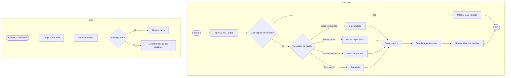

# Plan - Sistema de Licencias Medicas

## Apartado de Negocio

### Problema
Las empresas reciben licencias medicas en formato papel y deben validar manualmente si los datos son correctos (tipo, fechas, dias, RUT). Esto genera errores humanos, retraso en la tramitacion y riesgo de aceptar licencias con datos inconsistentes o fraudulentos.

### Solucion
Un sistema que permita ingresar manualmente los datos de una licencia medica, aplicar reglas de validacion, registrar el resultado en un archivo JSON y mostrarlo en consola y en una pagina web.

### Alcance
- **Entra**: ingreso manual de 7 datos de la licencia, validacion con 4 resultados, guardado en JSON, tabla con tabulate en consola, vista web con Django.
- **No entra**: base de datos, login, API, OCR, conexion a sistemas externos.

### MoSCoW

| Prioridad | Funcion |
|-----------|---------|
| **Must** | Ingresar y convertir los 7 datos de la licencia por input() |
| **Must** | Validar los datos y decidir entre 4 resultados con motivos distintos |
| **Must** | Guardar registro en datos.json |
| **Must** | Mostrar resumen con tabulate |
| **Must** | Vista Django que reutiliza la decision y muestra datos.json |
| **Should** | OCR con pytesseract/Pillow |
| **Should** | Alerta si fecha no cuadra con dias de reposo |
| **Could** | Conexion a lista de medicos fraudulentos |
| **Could** | Envio automatico por correo |
| **Won't** | Clave unica, SQL, monorepo, API externa |

## Apartado Tecnico

### Datos de Entrada

| Dato | Tipo | Ejemplo |
|------|------|---------|
| nombre_medico | str | "Dr. Juan Perez" |
| rut_medico | str | "12.345.678-5" |
| nombre_funcionario | str | "Maria Lopez" |
| rut_funcionario | str | "11.111.111-1" |
| dias_reposo | int | 7 |
| fecha_emision | str | "15/08/2026" |
| tipo_licencia | int | 1-7 |

### Regla de Decision (4 resultados)

| # | Condicion | Resultado |
|---|-----------|-----------|
| 1 | nombre vacio, tipo no es 1-7, dias <= 0, formato fecha invalido, o RUT invalido | Dato invalido |
| 2 | fecha emision es futura | Rechazo - fecha invalida |
| 3 | dias superan maximo del tipo de licencia | Rechazo - dias excedidos |
| 4 | todo valido | Aceptada |

### Diagrama de Flujo

Los estados, mensajes, tipos de licencia, dias maximos y formatos usados por este flujo se obtienen de las constantes centralizadas en `solucion.py`.

### Paquete Externo
- **tabulate**: mostrar el resumen como tabla en consola (evaluado en 1.1.3)

### Pantalla Web
- **Direccion**: `http://127.0.0.1:8000/resumen/`
- **Muestra**: tabla con todos los registros de licencias procesadas
